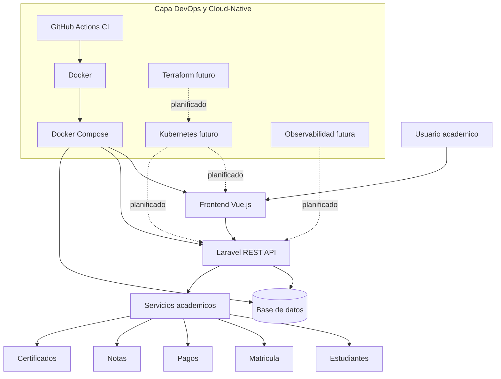

# Cloud-Native Academic Management System

Repositorio central de arquitectura, integracion DevOps y preparacion cloud-native para un sistema academico orientado a instituciones de educacion superior.

El proyecto no solo desarrolla una aplicacion academica; tambien automatiza como se prueba, se empaqueta y se prepara para desplegarse en una arquitectura cloud-native.

## Proposito del sistema

El sistema busca modernizar procesos academicos que suelen gestionarse de forma fragmentada o manual: registro de estudiantes, matriculas, pagos, asignaturas, notas, certificados, roles, permisos, reportes y autenticacion. La propuesta integra una API Laravel, una interfaz Vue.js y una capa DevOps que formaliza calidad, reproducibilidad, automatizacion y preparacion para despliegue en nube.

Desde una perspectiva academica, este repositorio puede sustentar una investigacion de maestria sobre migracion cloud-native de sistemas de gestion academica en instituciones de educacion superior latinoamericanas, con foco en automatizacion, portabilidad, escalabilidad y gobierno tecnico.

## Repositorios del sistema

| Capa | Repositorio | Tecnologia | Responsabilidad |
| --- | --- | --- | --- |
| Backend | [dayanarojasdrp/academic-management-api](https://github.com/dayanarojasdrp/academic-management-api) | Laravel REST API | Logica academica, autenticacion Sanctum, datos y servicios API |
| Frontend | [Sunaymg04/academic-management-web](https://github.com/Sunaymg04/academic-management-web) | Vue.js | Interfaz de usuario para gestion academica |
| DevOps/Cloud | [dayanarojasdrp/cloud-native-academic-management-system](https://github.com/dayanarojasdrp/cloud-native-academic-management-system) | Docker, GitHub Actions, documentacion cloud-native | Integracion, calidad, empaquetado, arquitectura y roadmap cloud |

## Arquitectura general



El archivo fuente del diagrama esta en [diagrams/architecture.mmd](diagrams/architecture.mmd).

## Fase 3: Integracion DevOps

Esta fase convierte el proyecto en una base preparada para evolucionar hacia nube. La prioridad no es desplegar todavia en Kubernetes ni crear infraestructura real en AWS, sino establecer los artefactos que hacen posible una migracion disciplinada:

- Pipelines de integracion continua para backend y frontend.
- Construccion reproducible de imagenes Docker.
- Entorno local integrado con Docker Compose.
- Documentacion tecnica para despliegue, variables, decisiones y roadmap.
- Planes formales para Kubernetes, Terraform y observabilidad.

## Tecnologias consideradas

- Laravel, PHP, Composer y Laravel Sanctum.
- Vue.js, Node.js 24 y npm.
- Docker y Docker Compose.
- GitHub Actions para CI y validacion automatizada.
- PostgreSQL como base de datos recomendada para el entorno integrado.
- Nginx como reverse proxy opcional.
- Kubernetes, Terraform, Prometheus y Grafana como roadmap cloud-native.

## Estado actual y roadmap

| Area | Estado |
| --- | --- |
| Backend Laravel | Existente en repositorio independiente |
| Frontend Vue | Existente en repositorio independiente |
| Repositorio DevOps/Cloud | Estructura base creada en esta fase |
| Docker Compose | Preparado para demo local integrada |
| GitHub Actions | Workflows base para CI y builds |
| Kubernetes | Plan documentado, no implementado |
| Terraform | Plan documentado, no ejecutado |
| Observabilidad | Plan documentado, pendiente de instrumentacion |

Consulta [docs/CLOUD_NATIVE_ROADMAP.md](docs/CLOUD_NATIVE_ROADMAP.md) para la vision por fases.

## Estructura del repositorio

```text
cloud-native-academic-management-system/
├── README.md
├── docs/
│   ├── ARCHITECTURE.md
│   ├── DEVOPS_INTEGRATION.md
│   ├── DEPLOYMENT.md
│   ├── ENVIRONMENT_VARIABLES.md
│   ├── DECISIONS.md
│   ├── CLOUD_NATIVE_ROADMAP.md
│   ├── KUBERNETES_PLAN.md
│   ├── TERRAFORM_PLAN.md
│   └── OBSERVABILITY_PLAN.md
├── docker/
│   ├── backend.Dockerfile
│   ├── frontend.Dockerfile
│   └── nginx.conf
├── docker-compose.yml
├── .github/
│   └── workflows/
│       ├── backend-ci.yml
│       ├── frontend-ci.yml
│       └── docker-build.yml
├── env/
│   ├── backend.env.example
│   └── frontend.env.example
└── diagrams/
    └── architecture.mmd
```

## Ejecucion local integrada

Este repositorio asume que los repositorios de backend y frontend existen como directorios hermanos:

```text
/Users/harrydouglass/Documents/
├── academic-management-api
├── academic-management-web
└── cloud-native-academic-management-system
```

Para levantar el entorno integrado:

```bash
cp env/backend.env.example env/backend.env
cp env/frontend.env.example env/frontend.env
docker compose up --build
```

Mas detalles en [docs/DEPLOYMENT.md](docs/DEPLOYMENT.md).

## Documentacion principal

- [Arquitectura](docs/ARCHITECTURE.md)
- [Integracion DevOps](docs/DEVOPS_INTEGRATION.md)
- [Despliegue local](docs/DEPLOYMENT.md)
- [Variables de entorno](docs/ENVIRONMENT_VARIABLES.md)
- [Decisiones tecnicas](docs/DECISIONS.md)
- [Roadmap cloud-native](docs/CLOUD_NATIVE_ROADMAP.md)
- [Plan Kubernetes](docs/KUBERNETES_PLAN.md)
- [Plan Terraform](docs/TERRAFORM_PLAN.md)
- [Plan de observabilidad](docs/OBSERVABILITY_PLAN.md)
