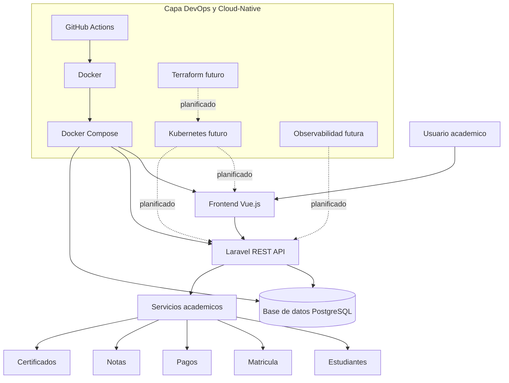

# Arquitectura del sistema

## Vision general

Cloud-Native Academic Management System se organiza como una arquitectura de tres capas principales: frontend, backend y plataforma DevOps/Cloud. Esta separacion permite que la aplicacion academica evolucione desde un entorno local hacia un modelo reproducible, automatizado y preparado para despliegue en infraestructura cloud-native.

La arquitectura responde a una necesidad frecuente en instituciones de educacion superior latinoamericanas: modernizar sistemas academicos sin perder trazabilidad, gobierno tecnico ni capacidad de evolucion incremental.

## Componentes

| Componente | Tecnologia | Funcion |
| --- | --- | --- |
| Frontend | Vue.js | Interfaz para usuarios academicos y administrativos |
| Backend | Laravel REST API | Servicios de dominio, autenticacion, reglas academicas y acceso a datos |
| Base de datos | PostgreSQL recomendado | Persistencia transaccional de informacion academica |
| DevOps | GitHub Actions, Docker, Docker Compose | Automatizacion de calidad, builds y entorno reproducible |
| Cloud futuro | Kubernetes, Terraform | Orquestacion e infraestructura como codigo |
| Observabilidad futura | Prometheus, Grafana, logs, alertas | Medicion operacional y supervision del sistema |

## Flujo funcional

1. El usuario accede al frontend Vue.js.
2. El frontend consume la API Laravel mediante endpoints REST.
3. Laravel valida autenticacion, permisos y reglas de negocio.
4. La API consulta y persiste informacion en la base de datos.
5. Los servicios academicos gestionan estudiantes, matriculas, pagos, notas y certificados.
6. La capa DevOps automatiza pruebas, empaquetado y preparacion de despliegue.

## Diagrama

## Criterios arquitectonicos

- Separacion de responsabilidades entre interfaz, API y plataforma DevOps.
- Portabilidad mediante contenedores.
- Automatizacion de validaciones con CI.
- Preparacion progresiva para Kubernetes e infraestructura como codigo.
- Documentacion de decisiones para trazabilidad tecnica y academica.
- Evolucion incremental para evitar costos cloud antes de la fase de despliegue real.
